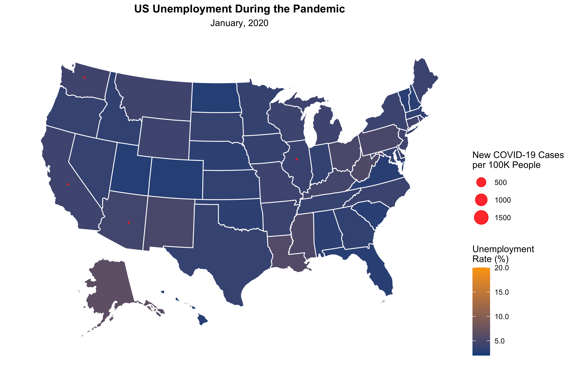

# Pandemic Unemployment

This project uses several publicly available data sets to create an animated map displaying COVID cases and unemployment rates in the US.



To read more about this project, visit this [webpage](https://spatial-data-discovery.github.io/project-ben-ralston.html).

## Installation

Clone the repository and use the package manager [pip](https://pip.pypa.io/en/stable/) to install the required packages.

```bash
pip install -r requirements.txt
```

## Usage

1. Run [process_datasets.py](process_datasets.py) with:

```bash
python process_datasets.py
```

2. Run [create_visualizations.r](create_visualizations.r) in [RStudio](https://www.rstudio.com/products/rstudio/).

3. Run [create_animation.py](create_animation.py) with:

```bash
python create_animation.py
```

## Credits:

- [Unemployment data](data/ststdnsadata.xlsx) from [U.S. Bureau of Labor Statistics](https://www.bls.gov/).

- [COVID data](data/United_States_COVID-19_Cases_and_Deaths_by_State_over_Time.csv) from [Centers for Disease Control and Prevention](https://www.cdc.gov/).

- [Population data](data/nst-est2019-alldata.csv) from [U.S. Census Bureau](https://www.census.gov/en.html).

- [State centroid coordinates](data/states.csv) from [Google Developers](https://developers.google.com/).

## License

[MIT](https://choosealicense.com/licenses/mit/)
